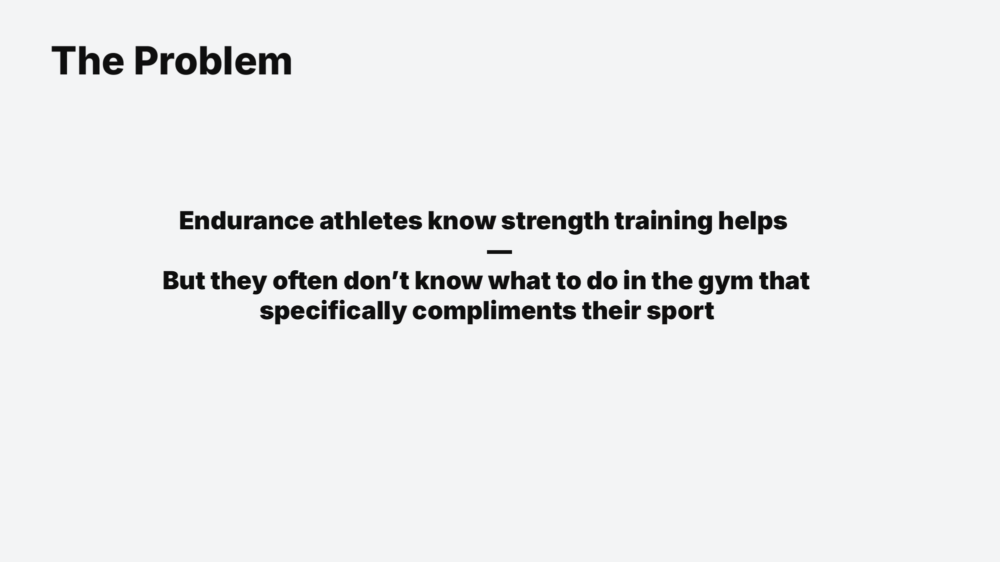
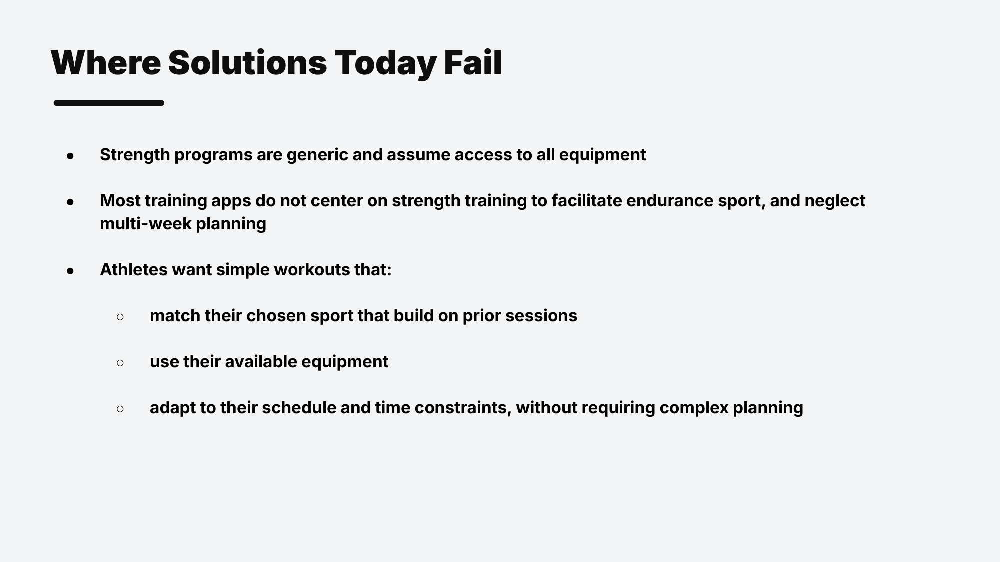
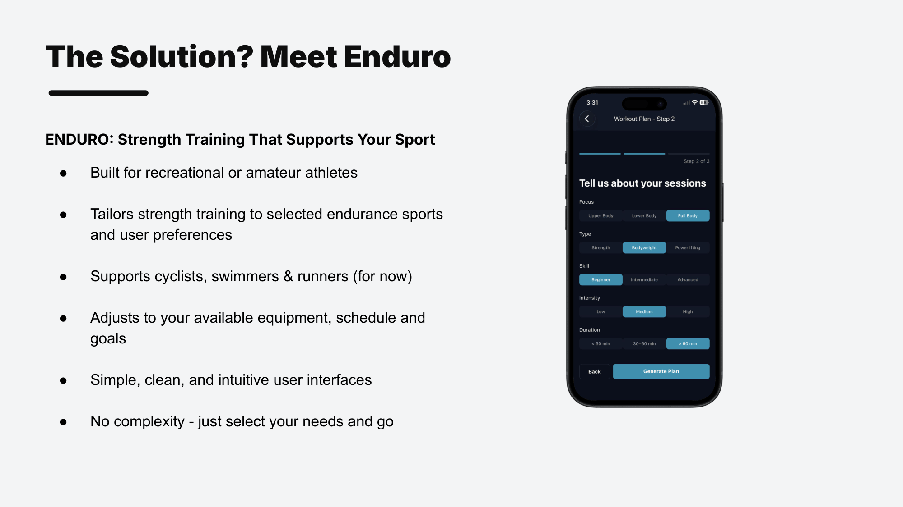
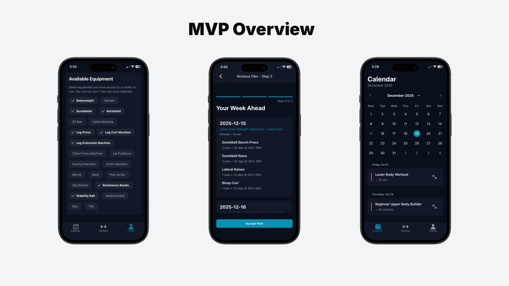

# Enduro: AI-Powered Strength Workouts for Endurance Athletes

**Enduro** is a full-stack fitness app designed to help endurance athletes (like cyclists and runners) integrate smart, strength-focused workouts into their training routine without compromising endurance performance.  

Using AI and user selections, Enduro generates personalized workouts based on user goals, fitness levels, and available equipment. Built with Node.js, Express, React Native, and Supabase, it’s designed for flexibility, intelligent recommendations, and real-world usability.

> Deployed to TestFlight. Actively developed.

## Quick Links
[Features](#features) · [Tech Stack](#tech-stack) · [Roadmap](#roadmap)

---

## Overview
The slides below walk through the problem this app solves, why existing solutions fall short, and how Enduro addresses it.

---

## Features

* **AI-Powered Workout Generation**  
  generate personalized single-day or multi-day workout plans based on your preferences:
  * workout focus, type, skill level, intensity, and duration
  * automatically includes warm-up and main sessions
  * optimized for endurance athletes to balance gym training and endurance performance

* **User Profile Customization**  
  * choose metric or imperial units  
  * define preferred and available equipment  
  * input 1rm (one-rep max) values for accurate scaling  
  * set training goals and constraints for personalized ai output  

* **Workout Management**  
  * generate, save, and retrieve previous quick workouts  
  * accept or reject generated workouts  
  * mark workouts as complete  

* **User Authentication**  
  * signup, login, reset password, and email verification via supabase authentication  

* **MVP Status**  
  * fully supports single (quick) workouts  
  * multi-day workout plans in development  
  * future features will include adaptive adjustments for:
    * illness or injury
    * travel
    * upcoming events or competitions  
  * dashboard view for progress tracking coming soon

---

## Tech Stack

**Backend**  
* Node.js  
* Express  

**Frontend**  
* Expo Go  
* React Native  
* React Native Paper  
* TypeScript  

**Database & Auth**  
* Supabase (PostgreSQL + Auth service)

**Testing**  
* Jest  
* Jest-Expo  
* Supertest  
* Testing Library (React Native)

**3rd Party APIs**  
* OpenAI API (for AI-generated workout plans)

---

## Roadmap

* **Multi-Day AI Training Plans** - Generate structured programs over weeks or months  
* **Adaptive Planning** - Adjusts training based on rest, travel, illness, and event data  
* **Dashboard & Insights** - Track progress, completion rates, and workout metrics  
* **Exercise Guidance** - Add movement cues, demo videos, and AI-assisted form feedback  
* **Social Features** - Share training progress and connect with teammates or coaches  
* **Custom Workouts** - Allow users to manually create and save their own workouts (for those who prefer full control over training design)  

*Source is private while the app is in active development. 
Happy to discuss architecture or technical decisions in more detail.*
